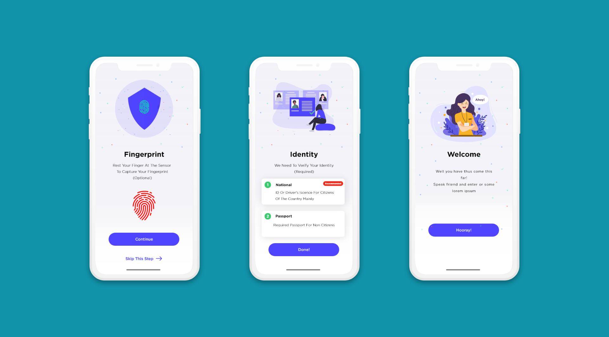
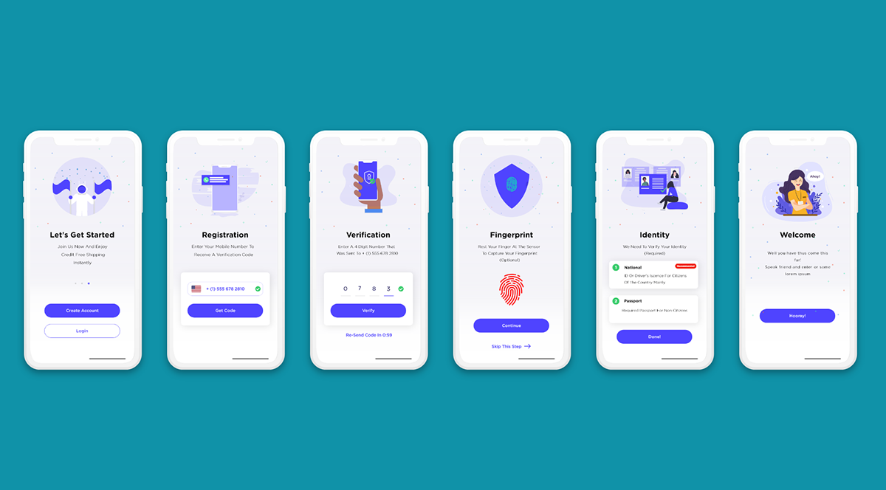
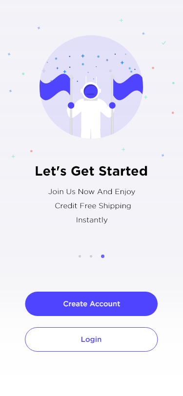
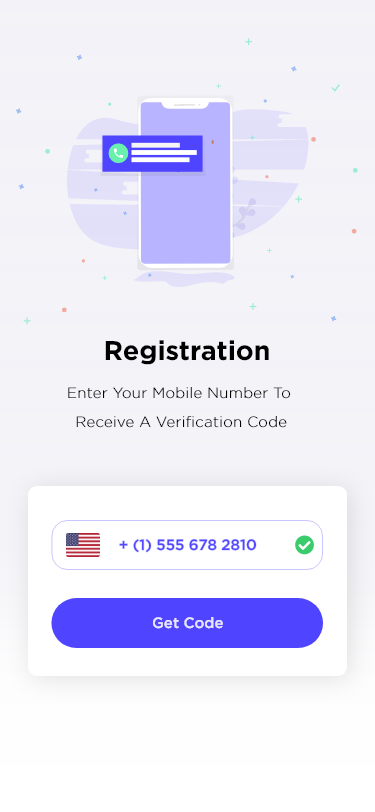
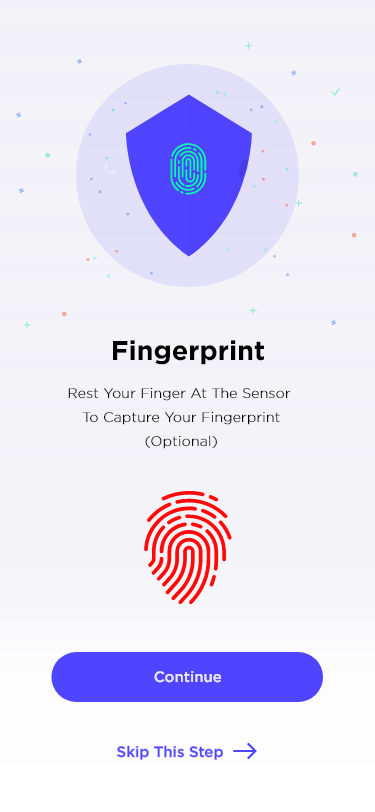
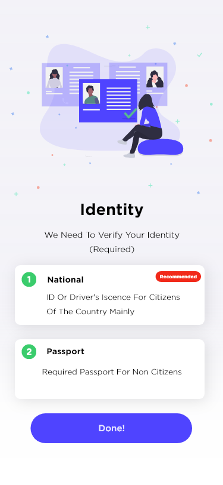
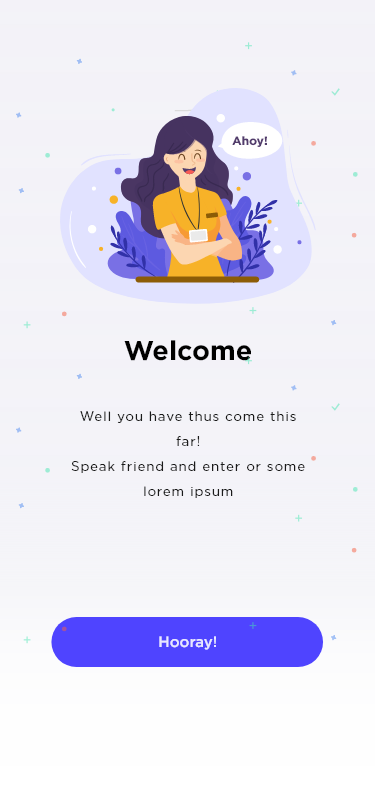

<h1 align="center">
  Onboarding App
</h1>
<h3 align="center">
  <a href="http://davidcobbina.com" target="_blank">davidcobbina.com</a>
</h3>

  Beautifully crafted with <strong>flutter</strong> and love, a useful UI Kit for developers and designers 
who want to kick start their app with a beautiful onboarding screen.

  Find actual designs at (https://www.behance.net/gallery/87302761/Onboarding-Screens-Free?tracking_source=search_projects_recommended%7COnboarding%20screens%20free)

### OnBoarding Initial Screens

## OnBoarding Final Screens

## All Screens

## Get Started Screen

## Registration Screen

## Verification Screen

## Fingerprint Screen

## Identity Screen

## Welcome Screen

